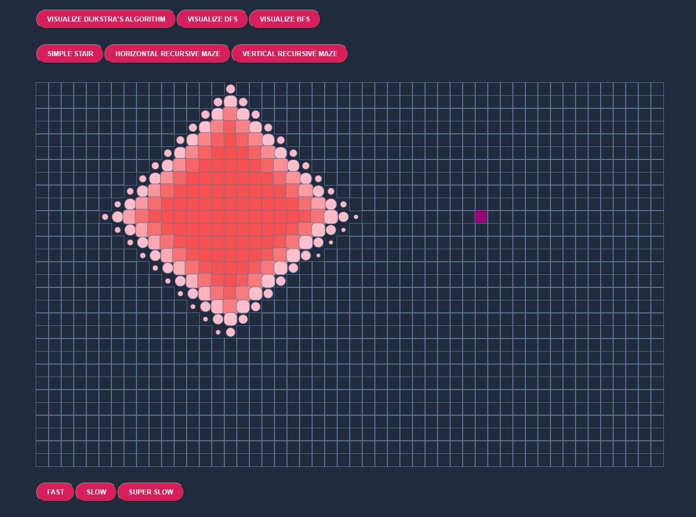
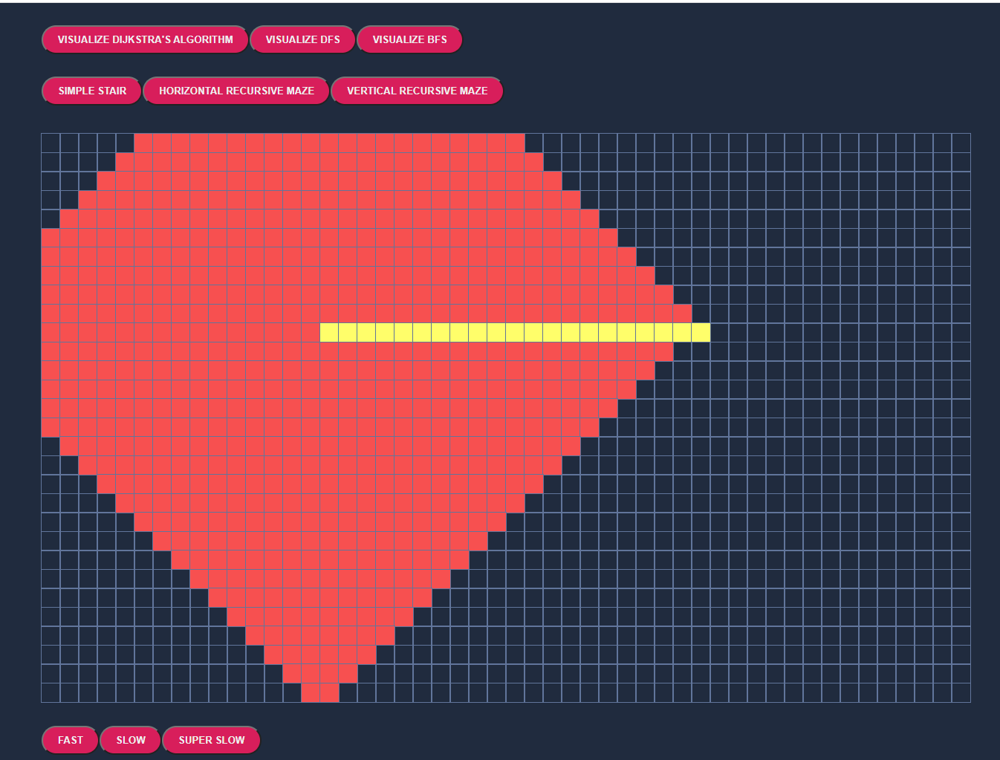

# AlgoVisualizer
# Description
Visualizer for various algorithms: DFS, BFS, DIJKSTRAS
# Demo
When the user enters they see this home page.
 
At the top there are various options for different graph algorithms (DIJKSTRA's, DFS, BFS) that users may attempt
Here is an example of Dijkstra's algorithm being run on a graph with no barriers  
  
