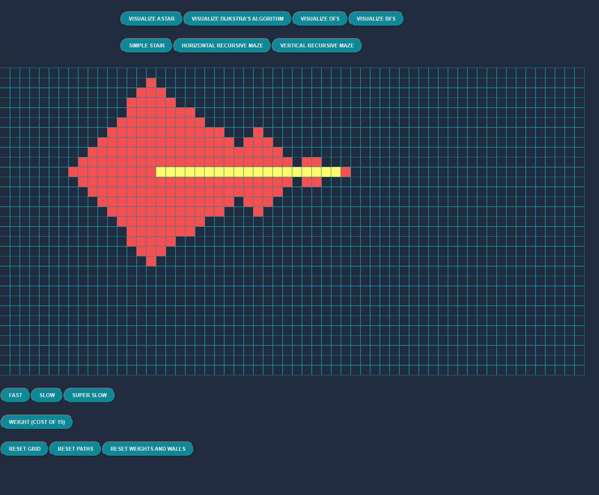
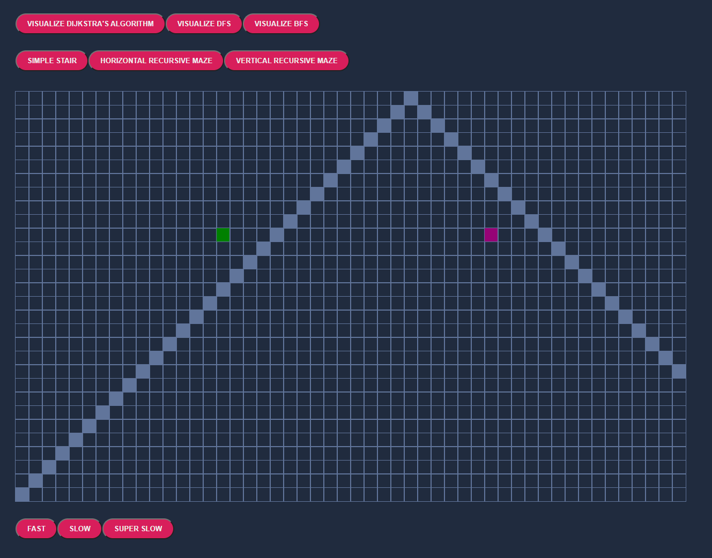
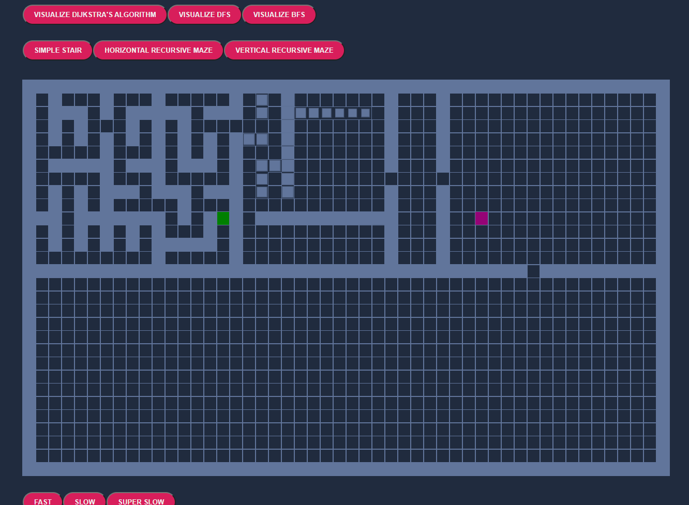
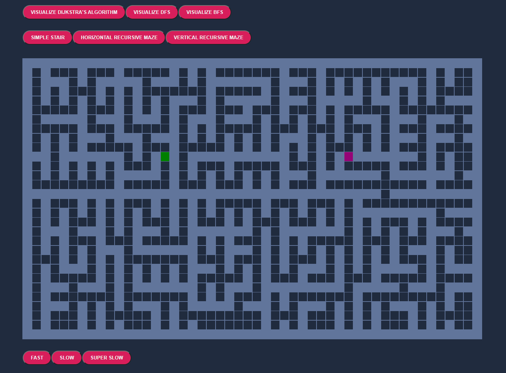
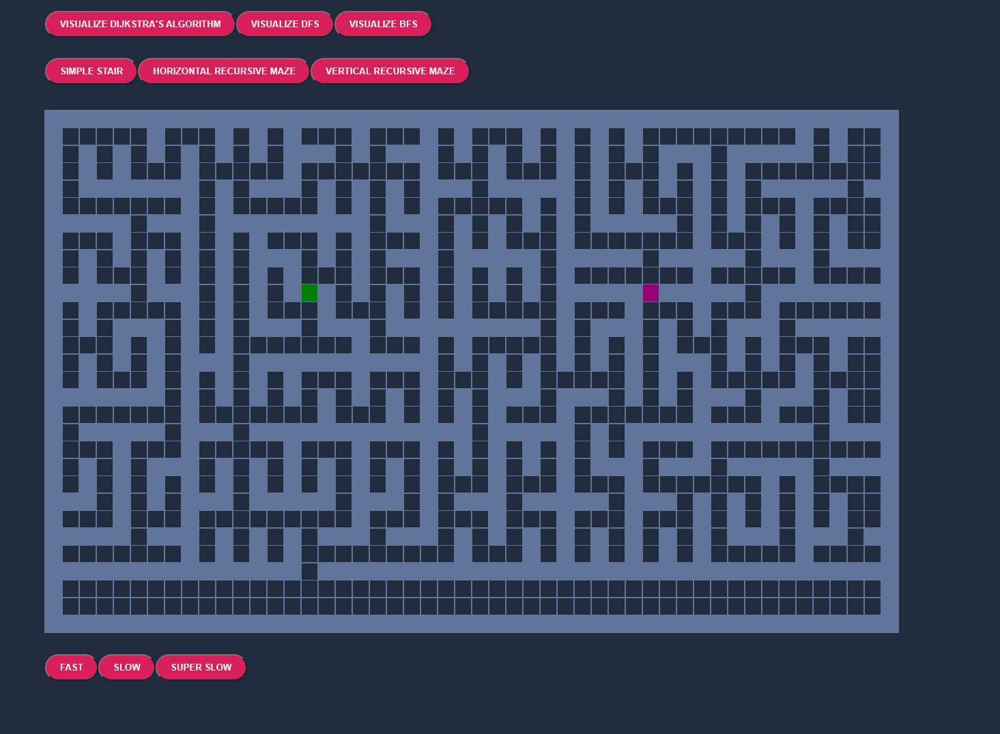
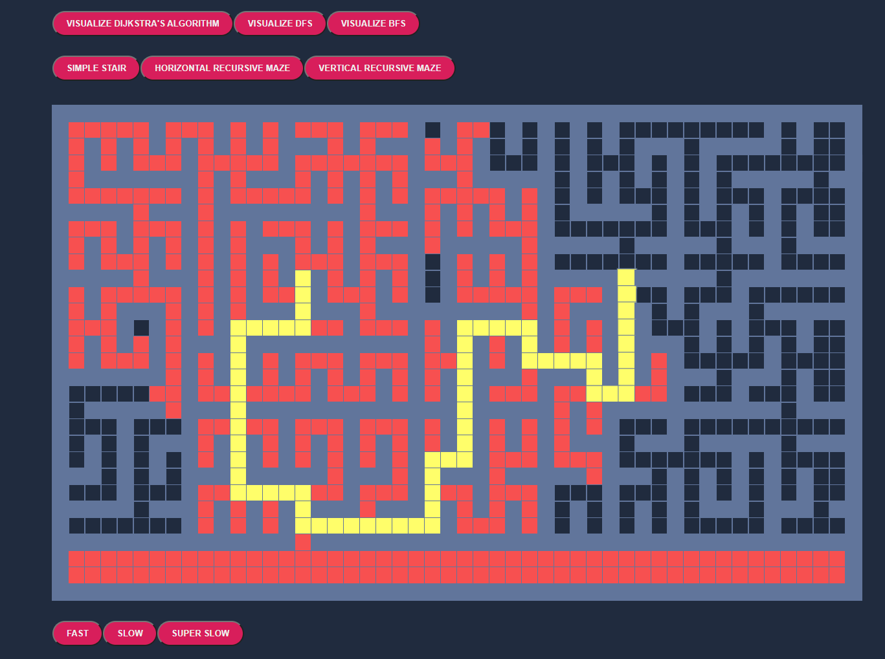

# AlgoVisualizer
# Description
Visualizer for various algorithms: DFS, BFS, DIJKSTRAS
# Demo
When the user enters they see this home page.
 
At the top there are various options for different graph algorithms (DIJKSTRA's, DFS, BFS) that users may attempt. 
Here is an example of Dijkstra's algorithm being run on a graph with no barriers  
   
Here is the result of running Astar with no barriers 

Users also have the ability to create barriers by clicking and dragging the mouse or they can select the options at the top for custom graphs. 
Here is a diagram of the options 
Simple stair 
  
Here is the recursively built horizontal maze which always has a unique construction 
   
Another horizontal maze to show Uniqueness  
  
Finally, here is the result Dijkstra's algorithm being run on the second horizontal maze  
  
